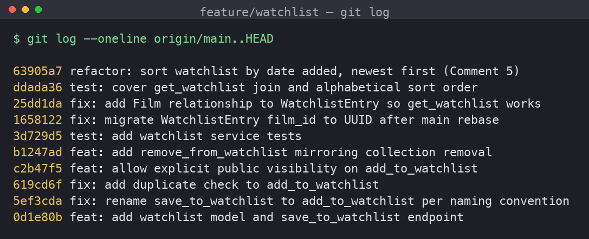

# PR Response Doc — CineLog Watchlist Feature

> **Note to reviewer:** responses below are grouped by comment. Comments 4 and 5
> are design decisions; my reasoning for each is written out in full.

---

## AI Usage

I used AI (Claude Code) as an assistant in the following concrete ways:

- **Orientation.** Before reading the review, I had it summarize `models.py`,
  `services/collection_service.py`, and `tests/test_collection.py` so I understood
  the `verb_to_noun` naming, the `AlreadyIn…Error` deduplication pattern, and the
  fixture layout (`app` / `sample_user` / `sample_film`) I would need to mirror.
- **Pattern matching.** For Comment 2 I compared `add_to_collection`'s existing-entry
  check against what `add_to_watchlist` was missing, then wrote the equivalent guard.
- **Commit hygiene.** I had it check my `git log --oneline` against the Conventional
  Commits spec and flag any message that bundled more than one logical change.
- **Stress-testing my design arguments.** After drafting the Comment 4 and Comment 5
  responses I asked it to argue the *opposite* side (see the notes under each). Where
  it raised a real gap I hadn't covered, I revised; where it repeated something I'd
  already addressed, I left the argument as-is.

> _(Fill in / adjust this to match how you actually worked, and make sure the
> Comment 4 and 5 wording below is genuinely yours.)_

---

## Comment 1 — Rename `save_to_watchlist()` → `add_to_watchlist()`

**What I did:**
Renamed the service function in `services/watchlist_service.py` and updated the one
call site in `routes/watchlist/watchlist.py` (both the `import` and the call inside
`add_film`). The name now matches the `verb_to_noun` convention documented in
`CONTRIBUTING.md` and used by `add_to_collection` / `remove_from_collection`.

**How I verified:**
`grep -rn "save_to_watchlist" . --include='*.py'` returned zero matches afterward,
and `pytest tests/ -v` stayed green. `app.py` imports the blueprint
(`watchlist_bp`), not the function, so no change was needed there.

---

## Comment 2 — Deduplication

**What I did:**
Added an `AlreadyInWatchlistError` (mirroring `AlreadyInCollectionError`) and a
pre-insert check in `add_to_watchlist`: before creating a `WatchlistEntry` it queries
for an existing `(user_id, film_id)` row and raises if one exists. I also wired the
`add` endpoint to translate the service exceptions into HTTP status codes
(`409` for a duplicate, `404` for a nonexistent film) — the route previously imported
`FilmNotFoundError` but never handled it, so a bad film id would have 500'd.

**How I verified:**
I followed `add_to_collection`'s structure exactly (it does `filter_by(...).first()`
then raises `AlreadyInCollectionError`). Tests: `test_add_to_watchlist_duplicate_raises`
adds the same film twice, asserts the error, and asserts the row count stays at 1.
End-to-end, `POST /watchlist/<uid>/add` twice returns `201` then `409`.

---

## Comment 3 — Missing test

**What I did:**
Created `tests/test_watchlist.py` using the same fixtures as `test_collection.py`.
The required test is `test_add_to_watchlist_nonexistent_film_raises`, the direct
equivalent of `test_add_to_collection_nonexistent_film_raises`: it calls
`add_to_watchlist` with a UUID that isn't in the DB and asserts `FilmNotFoundError`.
(See the stretch section for the additional tests in that file.)

**How I verified:**
`pytest tests/test_watchlist.py -v` — all pass; `pytest tests/ -v` — 13 pass.

---

## Comment 4 — Default visibility (`public=True`)  ·  *design decision (pushback)*

**DRAFT — rewrite in your own voice before submitting.**

**My position:** Keep the `public=True` default.

**Reasoning:**
CineLog describes itself as *"a community film tracking app."* The product's whole
value is social — seeing what other people are watching and want to watch. A watchlist
is *aspirational* ("films I want to watch"), not a record of behavior. That matters,
because the more sensitive signal in this app — what you've actually *watched* and how
you *rated* it — lives on `CollectionEntry`, and that model has **no** `public` flag at
all. The schema itself treats a watchlist as the shareable, low-stakes list and the
collection as the private record. Defaulting the watchlist to public is consistent with
that existing design intent, not a new privacy choice I'm inventing.

Defaults also decide behavior for the majority: most users never change a default. If
watchlists defaulted to private, the community/discovery surface would start empty and
essentially never fill in — which would quietly kill the feature the app exists for. A
public default is also the mental model users bring from comparable community film apps
(a public watchlist).

**Tradeoff acknowledged:**
The reviewer's instinct — privacy-by-default, let people opt *in* to sharing — is the
safer principle in general, and public-by-default does risk a user broadcasting intent
they'd rather keep private. I'm accepting that tradeoff *because* (a) a "want to watch"
list is low-sensitivity relative to viewing history, and (b) I've kept the door open:
the `public` column is per-entry and I added an explicit `public` parameter to
`add_to_watchlist` (see stretch), so a privacy-conscious caller can set
`public=False` per film without touching the default. If CineLog ever attaches
sensitive signals to watchlist entries (notes, private reasons), the default should be
revisited then.

> _Devil's-advocate pass:_ I asked AI for the strongest counterargument. It raised
> "public-by-default can violate user expectations under privacy-by-design norms even
> for low-sensitivity data." I addressed that by leaning on the CineLog-specific
> schema evidence (collection has no `public` flag) and the per-entry override, rather
> than a generic "it's fine" — that's the distinction I want the argument to make.

---

## Comment 5 — Sort order  ·  *design decision*

**DRAFT — rewrite in your own voice before submitting.**

**My position:** I agree with the maintainer — switch from alphabetical to
**date added, newest first** — and I implemented it
(`refactor: sort watchlist by date added, newest first`).

**Reasoning:**
The starter sorted the watchlist alphabetically by title (`Film.title.asc()`).
Alphabetical order is *arbitrary* for a discretionary personal list — nobody works
through their watchlist from "A" to "Z," so title position carries no real meaning
here. `get_collection` already sorts by `date_added` descending, and there's no
good reason for the two community lists to behave differently: a user who's learned
how their collection is ordered will expect the watchlist to match.
`date_added desc` also surfaces the films a user just added — the ones most on their
mind — and doubles as a useful signal for the public watchlist view (Comment 4):
"recently added" is a natural discovery ordering.

**Engagement with the reviewer's point:**
The reviewer's argument was consistency with `get_collection`, and I think that's
correct — so I didn't just defend the original code. But I want to be explicit that
I'm agreeing on the *merits*, not deferring: the real reason alphabetical loses isn't
"be consistent," it's that alphabetical answers a question (find a specific title)
that a watchlist rarely asks, while date-added answers the question it does ask
(what's new / what's next). The honest counterpoint is that a *long* watchlist is
easier to search alphabetically, and a strict FIFO user might prefer oldest-first —
the genuinely complete answer is a `?sort=` query parameter. But a single default has
to ship, and given the `get_collection` precedent, `date_added desc` is the right one.
I left the door open for a `sort` parameter as a follow-up rather than gold-plating
this PR.

> _Devil's-advocate pass:_ AI pushed back with "alphabetical aids findability in long
> lists." That's real, so I named it explicitly and answered it (findability is a
> weaker need than recency for this list type, and the proper fix is a sort param, not
> a different hard-coded default).

---

## Comment 6 — Rebase on updated `main`

**What conflicted:**
`main` had merged a refactor (`refactor: migrate film IDs from integer to UUID`) that
changed `Film.id` and `CollectionEntry.film_id` from `Integer` to `String(36)` **and
removed the old integer-based `WatchlistEntry` model from `models.py`**. My branch
still used integer film IDs and carried its own `WatchlistEntry`.

**How I resolved it:**
`git fetch origin` then `git rebase origin/main`. Git textually auto-merged
`models.py` (the refactor's edits and my additions were in different regions), but
that produced a **semantic** conflict: because the refactor had deleted `WatchlistEntry`
and my branch never re-touched that region, the rebase silently dropped
`WatchlistEntry` entirely — `from models import WatchlistEntry` then failed. I resolved
it by re-introducing `WatchlistEntry` with a **UUID `film_id`** (`db.String(36)`,
FK to `film.id`) so it matches the post-refactor schema, and updated the watchlist
service/route docstrings that still said the id was an `int`
(`fix: migrate WatchlistEntry film_id to UUID after main rebase`).

**How I verified no conflict remains:**
`git log --merges origin/main..HEAD` is empty (linear history, no merge commits).
The full suite passes on UUIDs (`pytest tests/` → 13 passed), and I drove the real
endpoints with UUID film ids (`add` → 201, duplicate → 409, unknown film → 404,
`view` → 200, `remove` → 200) — all correct.

---

## Stretch features

**`remove_from_watchlist(user_id, film_id)`** — added following
`remove_from_collection`: raises `NotInWatchlistError` if the film isn't on the list,
otherwise deletes the entry and returns `True`. Exposed as
`DELETE /watchlist/<user_id>/remove`. Tests: `test_remove_from_watchlist_removes_entry`
and `test_remove_from_watchlist_nonexistent_raises`.

**Second (unrequested) test — `test_same_film_on_two_users_watchlists_is_allowed`.**
I chose this edge case because the deduplication I added in Comment 2 is scoped to
`(user_id, film_id)`. It would be easy to over-correct into treating a film as
globally "taken," so this test proves two *different* users can both watchlist the
same film and end up with two rows. It guards the boundary of the dedup rule, which
the happy-path and duplicate tests don't touch.

**Visibility toggle — `public` parameter on `add_to_watchlist`.** Callers can pass
`public=<bool>` (service arg and JSON body field) to set visibility explicitly instead
of relying on the default; omitting it preserves `public=True`. This is also the
mitigation referenced in Comment 4. Tests: `test_add_to_watchlist_defaults_to_public`
and `test_add_to_watchlist_respects_explicit_private`.

**Bonus fix found via manual testing.** Driving `GET /watchlist/<user_id>` end-to-end
surfaced that `get_watchlist` dereferenced `entry.film`, but `WatchlistEntry` had no
relationship to `Film`, so the view 500'd. I added the relationship
(`fix: add Film relationship to WatchlistEntry so get_watchlist works`) and a
regression test, since the unit tests hadn't covered the view path.

---

## Commit history

Rewritten with `git rebase -i` into conventional, one-change-per-commit form
(the two original WIP commits — `added watchlist model and endpoint fixed a bug more
changes` and its follow-up — were squashed into a single `feat:` commit). No merge
commits.



_(The screenshot shows the ten substantive commits. The `docs:` commit that adds
this file is the most recent one on the branch and isn't pictured, since it's the
commit that contains this screenshot.)_

```
$ git log --oneline origin/main..HEAD
63905a7 refactor: sort watchlist by date added, newest first (Comment 5)
ddada36 test: cover get_watchlist join and alphabetical sort order
25dd1da fix: add Film relationship to WatchlistEntry so get_watchlist works
1658122 fix: migrate WatchlistEntry film_id to UUID after main rebase
3d729d5 test: add watchlist service tests
b1247ad feat: add remove_from_watchlist mirroring collection removal
c2b47f5 feat: allow explicit public visibility on add_to_watchlist
619cd6f fix: add duplicate check to add_to_watchlist
5ef3cda fix: rename save_to_watchlist to add_to_watchlist per naming convention
0d1e80b feat: add watchlist model and save_to_watchlist endpoint
```

---

## PR Description

### What this feature does
Adds a **watchlist** to CineLog: films a user wants to watch later, separate from their
collection of already-watched films. Users can add a film to their watchlist, remove
one, and view the whole list. Entries are public by default so they show up on
CineLog's community/discovery surfaces, and each entry can be made private per film.

### Endpoints
| Method | Endpoint | Description |
|--------|----------|-------------|
| `GET` | `/watchlist/<user_id>` | List the user's watchlist (newest added first) |
| `POST` | `/watchlist/<user_id>/add` | Add a film. Body: `{ "film_id": "<uuid>", "public": <bool?> }` |
| `DELETE` | `/watchlist/<user_id>/remove` | Remove a film. Body: `{ "film_id": "<uuid>" }` |

### Design decisions
1. **Default visibility = public** (Comment 4). A watchlist is a low-sensitivity,
   aspirational list on a community app, and the collection (the sensitive record) has
   no `public` flag — so watchlist entries default to public, with a per-entry
   `public=False` override for privacy.
2. **Sort order = date added, newest first** (Comment 5). Switched from alphabetical
   to match `get_collection` and to surface recent intent; a `?sort=` param is the
   natural future extension.

### How to test it manually
```bash
python -m venv .venv && source .venv/bin/activate
pip install -r requirements.txt
python app.py    # http://127.0.0.1:5000  (no frontend; use curl)
```
You need a real user id and film id. From a Python shell (`flask shell`-style) or a
quick script:
```python
from app import create_app, db
from models import User, Film
app = create_app()
with app.app_context():
    u = User(username="ada", email="ada@example.com"); db.session.add(u)
    f = Film(title="Arrival", year=2016, genre="Sci-Fi"); db.session.add(f)
    db.session.commit(); print("USER", u.id); print("FILM", f.id)
```
Then:
```bash
# add (expect 201)
curl -X POST localhost:5000/watchlist/<USER>/add -H 'Content-Type: application/json' -d '{"film_id":"<FILM>"}'
# add again (expect 409 — deduplicated)
curl -X POST localhost:5000/watchlist/<USER>/add -H 'Content-Type: application/json' -d '{"film_id":"<FILM>"}'
# add unknown film (expect 404)
curl -X POST localhost:5000/watchlist/<USER>/add -H 'Content-Type: application/json' -d '{"film_id":"nope"}'
# add private (expect 201, "public": false)
curl -X POST localhost:5000/watchlist/<USER>/add -H 'Content-Type: application/json' -d '{"film_id":"<FILM2>","public":false}'
# view (expect 200, newest first)
curl localhost:5000/watchlist/<USER>
# remove (expect 200) then remove again (expect 404)
curl -X DELETE localhost:5000/watchlist/<USER>/remove -H 'Content-Type: application/json' -d '{"film_id":"<FILM>"}'
```
Or just run the suite: `pytest tests/ -v` (13 tests).
